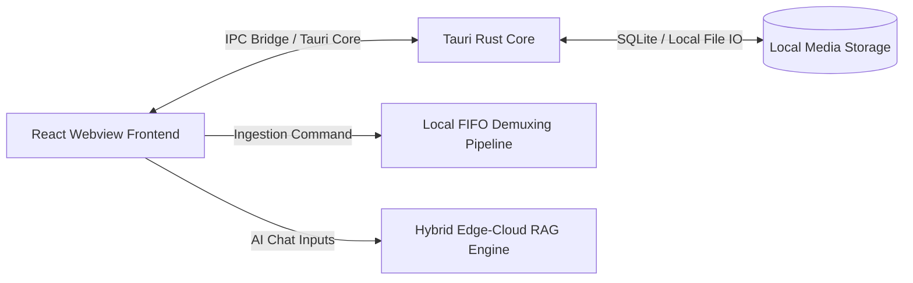

# LAURA AI 🎬 — Nexus Edit Platform

[](https://opensource.org/licenses/MIT)
[](https://tauri.app/)
[](https://react.dev/)
[](https://www.typescriptlang.org/)
[](https://tailwindcss.com/)

**Laura AI (Nexus Edit)** is a hardware-accelerated desktop video and audio editor built on the **Tauri 2.0** native shell. It pairs a premium React + TypeScript UI with local desktop integration and a hybrid edge-cloud RAG pipeline. Laura AI allows automated narrative video editing, audio-visual synchronizations, and smart timeline manipulations straight from a local workspace.

---

## 📖 Table of Contents
1. [Key Features](#-key-features)
2. [Architecture Blueprint](#-architecture-blueprint)
3. [User Interface Overview](#-user-interface-overview)
4. [Hardware-Accelerated Compilation](#-hardware-accelerated-compilation)
5. [Interactive Setup Guide](#-interactive-setup-guide)
6. [Security Shield](#-security-shield)
7. [License](#-license)

---

## ✨ Key Features

*   **💻 Native Tauri Desktop Runtime**: Low-overhead native windowing, file dialogs, and native C++ backend integrations.
*   **🔊 Audio-Master Timeline**: Responsive visual tracks showing timestamps, beats, and cuts.
*   **🤖 Cognitive AI Thread Bus**: Intelligent background video de-muxing and transcription jobs.
*   **📥 Media Ingest Pool**: Quick imports of local raw clips (`.mp4`, `.mov`, `.wav`, etc.) directly into local storage databases.
*   **🧠 Local & Cloud RAG Integration**: AI-assisted commands to trim, slice, or filter clips via natural language chat interfaces.

---

## 📐 Architecture Blueprint



---

## 🖥️ User Interface Overview

*   **Ingested Local Media Pool**: Keeps track of active media assets, displaying ingestion queue progress (transcription, beat extraction, etc.) and catalog libraries.
*   **AI Chat Command Terminal**: An inline chat box that accepts prompts like `"cut at the first beat"` or `"find where the speaker mentions revenue"`.
*   **Standalone Video Player**: A custom webGL preview player with frame-perfect playback indicators.
*   **Interactive Multi-track Timeline**: A multi-channel timeline that visualizes audio waves and beat alignment.

---

## 🛠️ Hardware-Accelerated Compilation

Since Laura AI is compiled as a native desktop application, you must install native compilation tools before generating distribution executables.

### Prerequisites (Windows)
1.  **Visual Studio Build Tools**: Linker support is required for compiling Rust binaries.
    *   Download from: [Visual Studio Installer](https://visualstudio.microsoft.com/visual-cpp-build-tools/).
    *   Select the workload: **Desktop development with C++**.
    *   Ensure components are checked: **MSVC build tools** and **Windows 10/11 SDK**.
2.  **Rustup**: Install the Rust programming language via [rustup.rs](https://rustup.rs/).

---

## 🚀 Interactive Setup Guide

Configure Laura AI on your machine:

<details>
<summary>📋 Step 1: Clone and Enter Repository</summary>

```bash
git clone https://github.com/MdSadman20040812/Laura_AI.git
cd Laura_AI
```
</details>

<details>
<summary>📦 Step 2: Install Node Dependencies</summary>

```bash
npm install
```
</details>

<details>
<summary>💻 Step 3: Run Development Server (Browser fallback)</summary>

```bash
npm run dev
```
Runs the editor in browser mockup mode at `http://localhost:5173`.
</details>

<details>
<summary>🖥️ Step 4: Run Dev Desktop Application (Native window)</summary>

```bash
npm run tauri dev
```
Compiles a debug build and launches the native editor app window.
</details>

<details>
<summary>📦 Step 5: Build Standalone Executable (.exe)</summary>

```bash
npm run tauri build
```
The compiled, optimized desktop installer/executable will be generated at:
`src-tauri/target/release/tauri-app.exe`
</details>

---

## 🛡️ Security Shield

To safeguard startup secrets and codebase "ingredients," Laura AI enforces client-side runtime sandboxing in web views:
*   Disables Webview DevTools inspection commands.
*   Disables typical inspection keyboard shortcuts (`F12`, `Ctrl+Shift+I`, `Ctrl+Shift+J`, `Ctrl+U`).
*   Blocks normal page interaction when third-party inspectors hook into context streams.

---

## 📄 License

This software is licensed under the MIT License. See [LICENSE](LICENSE) for details.
